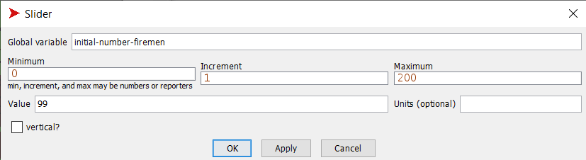
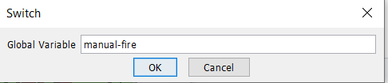
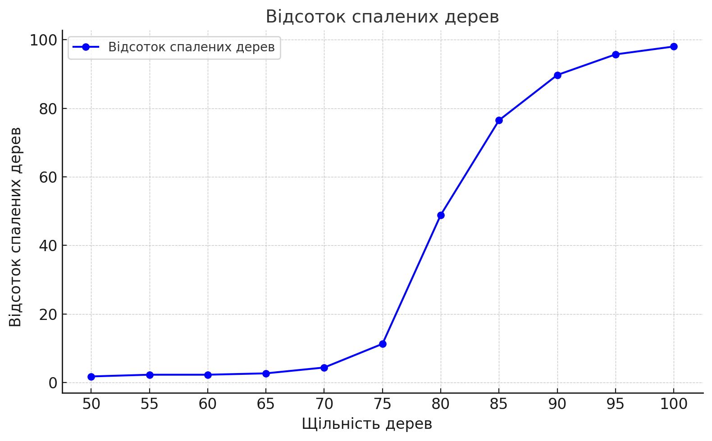
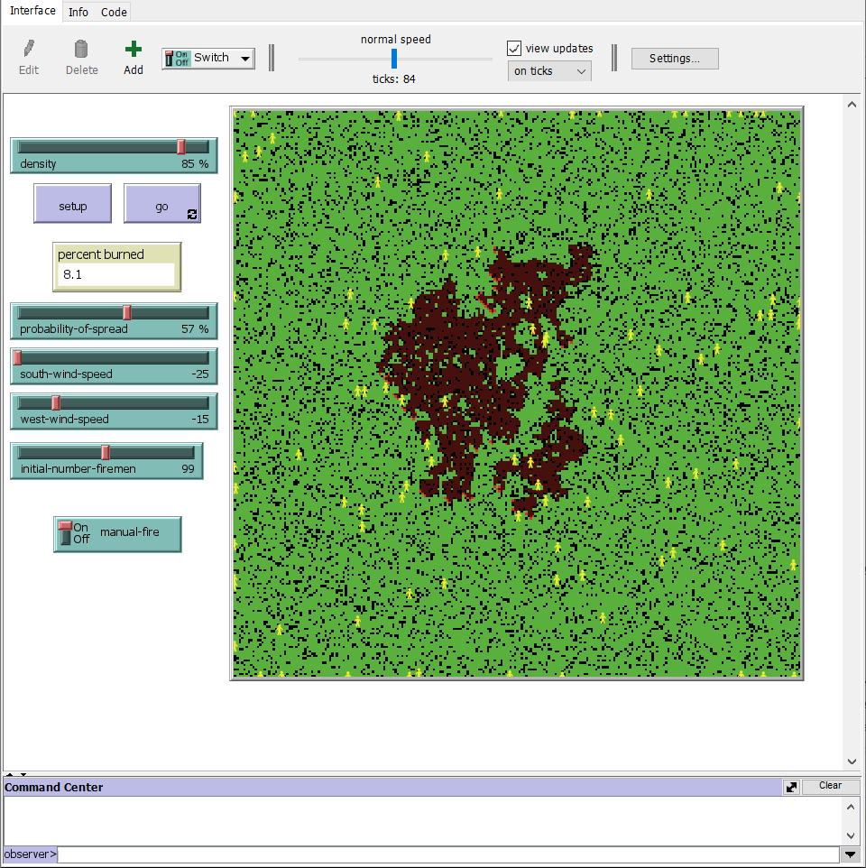

### Комп'ютерні системи імітаційного моделювання  
### Група СПм-23-5, **Холобок Владислав Іванович**  
### Лабораторна робота №**2**: Редагування імітаційних моделей у середовищі NetLogo  

---

### Варіант 5: Модель у середовищі NetLogo  
[Fire Simple Extension 2](http://www.netlogoweb.org/launch#http://www.netlogoweb.org/assets/modelslib/IABM%20Textbook/chapter%203/Fire%20Extensions/Fire%20Simple%20Extension%202.nlogo)  

---

### Зміни за варіантом  

**Додано агентів-"пожежників", кількість яких задається користувачем.**  
Агенти початково розташовуються випадковим чином на "пустих" клітинках (без дерев) і можуть рухатися в довільному напрямку, але тільки по клітинках, які ще не вигоріли (зеленого або чорного кольору).

Кількість агентів-"пожежників" задається через слайдер `initial-number-firemen`:  



Оголошено новий тип агентів з назвою `fireman`:  
```NetLogo
breed [firemen fireman]
```  

Процедура ініціалізації створює агентів-"пожежників" під час налаштування моделі. Якщо кількість агентів перевищує кількість пустих клітинок, вона обмежується їх кількістю. Пожежники мають форму "person", жовтий колір, розмір 5 та розміщуються випадковим чином:  
```NetLogo
to setup-turtles
  let black-patches count patches with [pcolor = black]
  if initial-number-firemen > black-patches [set initial-number-firemen black-patches]
  create-firemen initial-number-firemen [
    set shape "person"
    set color yellow
    set size 5
    setxy random-xcor random-ycor
    while [[pcolor] of patch-here != black and any? other turtles-here] [
      move-to one-of patches
    ]
  ]
end
```  

**Рух агентів-"пожежників":**  
Агенти рухаються на відстань одного кроку (`fd 1`), обертаючись на випадковий кут (`rt random 20`, `lt random 20`). Якщо агент потрапляє на клітинку з вигорілою зоною (червона клітинка), він переорієнтовується на найближчу зелену клітинку та рухається до неї:  
```NetLogo
to move
  rt random 20
  lt random 20
  fd 1
  if [pcolor] of patch-here = red [
    face min-one-of patches with [pcolor = green] [distance myself]
  ]
  if edge? [
    set heading (heading + 180) mod 360
  ]
end

to-report edge?
  report (xcor > max-pxcor or xcor < min-pxcor or ycor > max-pycor or ycor < min-pycor)
end
```  

**Гасіння пожежі:**  
Агенти гасять пожежу на поточній клітинці та на сусідніх. Процедура `put-out-fire` змінює колір клітинки з червоного на зелений:  
```NetLogo
to put-out-fire
  if [pcolor] of patch-here = red [set pcolor green]
  ask neighbors [
    if pcolor = red [set pcolor green]
  ]
end
```  

У процедурі `go` після руху агентів викликається `put-out-fire`, дозволяючи їм гасити пожежу під час пересування:  
```NetLogo
to go
  ...
  burn
  ask firemen [
    move
    put-out-fire
  ]
  ...
end
```  

---

### Зміни за власним вибором  

**Ручне додавання вогню за допомогою миші:**  
Додано перемикач `manual-fire`, який дозволяє користувачеві додавати вогонь у будь-яке місце моделі кліком миші:  

  

Якщо ручне додавання вогню активоване, модель не зупиняється після вигоряння пожежі, а новий вогонь додається за кліком:  
```NetLogo
to go
  ...
  ifelse manual-fire [
    if mouse-down? [
      ask patch mouse-xcor mouse-ycor [set pcolor red]
    ]
  ] [
    if all? patches [pcolor != red] [stop]
  ]
  ...
end
```  

**Оптимізація ініціалізації клітинок:**  
Код ініціалізації клітинок перенесено в окрему процедуру `setup-patches`. Вогонь на лівому краї додається лише за вимкненої опції `manual-fire`:  
```NetLogo
to setup-patches
  ask patches [
    if (random 100) < density [set pcolor green]
    if pxcor = min-pxcor and manual-fire = false [set pcolor red]
  ]
end
```  

---

### Обчислювальні експерименти  

#### 1. Вплив щільності дерев на відсоток вигорілих ділянок  
Досліджено залежність між щільністю дерев (50%-100%, крок 5%) та відсотком вигорілих клітинок у 11 симуляціях (~30-300 тактів).  

Параметри за замовчуванням:  
- **probability-of-spread**: 57%  
- **south-wind-speed**: 25  
- **west-wind-speed**: 25  
- **initial-number-firemen**: 200  
- **manual-fire**: Увімкнено  

| Щільність дерев (%) | Вигоріло (%) |
|----------------------|--------------|
| 50                  | 1.2          |
| 55                  | 1.5          |
| 60                  | 1.9          |
| 65                  | 2.4          |
| 70                  | 4.8          |
| 75                  | 5.4          |
| 80                  | 27.8         |
| 85                  | 57.0         |
| 90                  | 79.0         |
| 95                  | 88.0         |
| 100                 | 98.0         |

  

Зі збільшенням щільності дерев від 50% до 100% частка вигорілих зон зростає від 1.2% до 98.0%. У деяких випадках пожежники знижували відсоток вигорілих зон на 10%-20%, однак за високої щільності дерев їхній вплив зменшувався.  

---  
**Фінальний код моделі та інтерфейс:** [Посилання](Fire_Simple_Extension_3.nlogo)  
  
